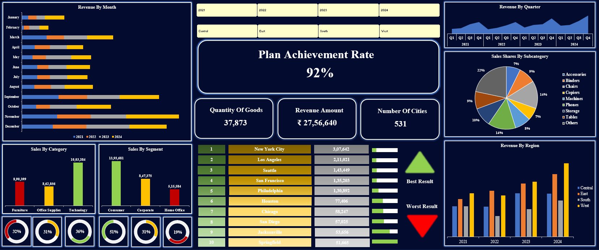

# Sales Performance Dashboard Analysis

  

This report provides a detailed analysis of the company's sales performance by leveraging data from two primary sources: the "Orders" sheet and the "Sales Plan" sheet. Together, these datasets offer a complete view of the business, facilitating both detailed operational insights and high-level strategic evaluation.

## Data Sources

The analysis is built upon two core datasets:

### "Orders" Sheet

The "Orders" sheet forms the basis for understanding the company's day-to-day business operations. It contains a granular, transactional view where each entry is a detailed record of a single sale.

* **Geographic Insights**: Data is broken down by City, State, and Region (Central, East, South, and West), which is crucial for evaluating local market performance.For example, a sale in Henderson, Kentucky, can be analyzed within the wider context of the South region's performance.
* **Customer and Product Segmentation**: Sales are categorized by Segment (Consumer, Corporate, Home Office). Products are classified by Category (e.g., Furniture, Office Supplies) and Sub-Category (e.g., Chairs, Binders). This segmentation is essential for targeted marketing and product development.
* **Temporal Trends**: The inclusion of Order Date, Year, and Month enables time-series analysis to identify seasonal trends and peak sales periods. This is valuable for planning future sales campaigns and managing inventory.

### "Sales Plan" Sheet

The "Sales Plan" sheet offers a strategic perspective and is the primary tool for evaluating how well the company is meeting its goals.

* **Performance vs. Plan**: This sheet directly compares Sales with the Sales Plan on both a yearly and regional basis. This comparison is critical for assessing the effectiveness of regional strategies.
* **Strategic Evaluation**: A significant variance between actual sales and the sales plan points to a need for deeper investigation into the contributing factors. For instance, a region that consistently underperforms against its plan may require a revised strategy or more resources.
* **Accountability and Goal Setting**: This dataset is fundamental for management to assess regional and yearly performance, hold teams accountable, and set realistic future goals.

## Dashboard Features

The dashboard visualizes the data through several key sections:

### Overall Performance Metrics

* **Plan Achievement Rate**: Shows the overall percentage of sales achieved against the sales plan.
* **Revenue Amount**: Displays total sales revenue in Indian Rupees, broken down by region and year.
* **Quantity by Goods**: Details the total quantity of goods sold, categorized by region and year.
* **Number of Cities**: Shows the total number of cities represented in the dataset for each region.

### Sales Analysis by Category and Segment

* **Sales by Category**: A column chart shows yearly sales for the three main product categories, while a doughnut chart displays the percentage contribution of each category.
* **Sales by Segment**: A column chart displays yearly sales for the Consumer, Corporate, and Home Office segments, complemented by a doughnut chart showing the percentage breakdown.
* **Sales by Subcategory**: A pie chart highlights the top 8 highest-selling subcategories.

### Geographic and Regional Performance

* **Revenue by Region**: This chart presents a yearly breakdown of sales across all product categories, organized by region.
* **Positive Rate of Cities**: This feature highlights the top 10 cities with the highest sales, showing their total yearly sales by region. This can be viewed as a bar chart.
* **Negative Rate of Cities**: This identifies the 10 cities with the lowest sales, also displayed as a bar chart showing total yearly sales by region.
* **Result Buttons**: The dashboard includes a "Best Result" button to show the "Positive Rate of Cities" and a "Worst Result" button for the "Negative Rate of Cities".

### Time-Based Performance

* **Revenue by Month**: A bar chart illustrates monthly sales across all four years.
* **Revenues by Quarter**: An area chart displays sales performance on a quarterly basis for all years.
